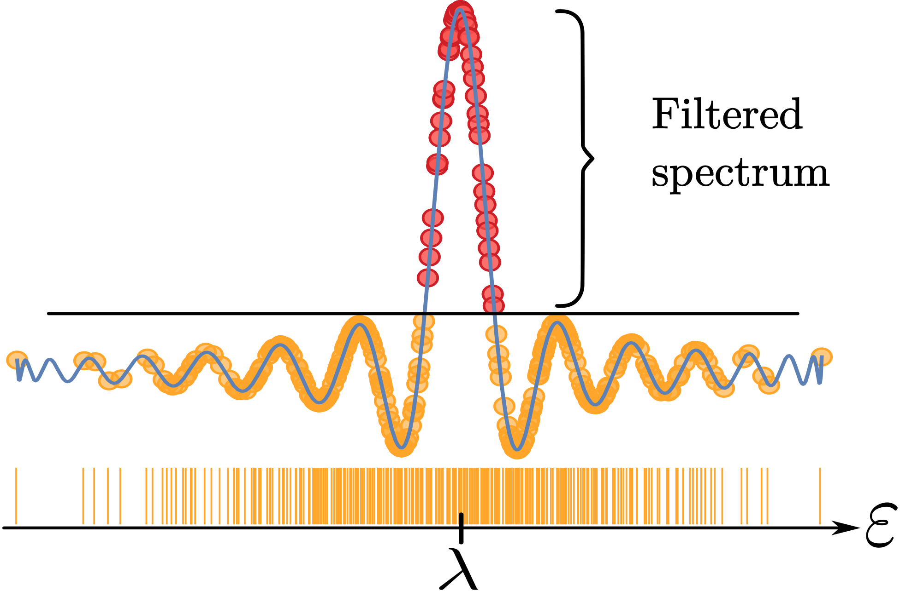

# Polfed.jl

[](https://github.com/RockClimbingRocks/Polfed.jl/actions)
[](http://www-f1.ijs.si/~rokpintar/Polfed.jl/)
[](LICENSE)

<p align="center">
  <picture>
    <source media="(prefers-color-scheme: dark)" srcset="docs/src/assets/logo-dark.svg">
    <source media="(prefers-color-scheme: light)" srcset="docs/src/assets/logo.svg">
    
  </picture>
</p>

`Polfed.jl` is a Julia package for polynomial filtering eigensolvers and
Hamiltonian tools for quantum many-body simulations.

<p>
  <a href="http://www-f1.ijs.si/~rokpintar/Polfed.jl/"></a>
  <a href="http://www-f1.ijs.si/~rokpintar/Polfed.jl/citation/#article"></a>
  <a href="http://www-f1.ijs.si/~rokpintar/Polfed.jl/citation/#code"></a>
  <a href="https://github.com/RockClimbingRocks/Polfed.jl"></a>
  <a href="https://scipost.org/SciPostPhysCodeb"></a>
  <a href="https://arxiv.org/abs/2605.10191"></a>
  <a href="https://juliapkgstats.com/pkg/Polfed?timeframe=30d&trendingPeriod=14d&userData=true&ciData=true&missingData=true"></a>
</p>

If `Polfed.jl` supports your research, please cite both the overview article
and the code. This helps make the method and the software visible, reusable,
and easier to maintain for the community. Citation details are collected on the
[citation page](http://www-f1.ijs.si/~rokpintar/Polfed.jl/citation/).

Version of the code: `v0.1.0`

## What Is POLFED?

Polynomial Filtering Exact Diagonalization (POLFED) is designed for eigenvalue
problems of the form

```math
H |\psi\rangle = E |\psi\rangle
```

where only a selected part of the spectrum is desired. The interface allows one
to target arbitrary spectral regions, while the method builds a polynomial
filter that amplifies components of a vector near the target energy $\lambda$ and
suppresses the rest of the spectrum. Krylov/Lanczos-type factorization is then
applied to the filtered problem.

<p align="center">
  <picture>
    <source media="(prefers-color-scheme: dark)" srcset="docs/src/assets/spectral-transform-webpage-dark.png">
    <source media="(prefers-color-scheme: light)" srcset="docs/src/assets/spectral-transform-webpage-light.png">
    
  </picture>
</p>

The original POLFED method was introduced by Piotr Sierant and collaborators in
[PRL](https://journals.aps.org/prl/abstract/10.1103/PhysRevLett.125.156601)
/ [arXiv](https://arxiv.org/pdf/2005.09534).

For a broader overview and practical discussion, read the `Polfed.jl` article:
[SciPost](https://scipost.org/SciPostPhysCodeb)
/ [arXiv](https://arxiv.org/abs/2605.10191).

## Features and Capabilities

- Lanczos and block Lanczos factorizations are supported; see
  [Lanczos and Block Lanczos Factorization](http://www-f1.ijs.si/~rokpintar/Polfed.jl/tutorials/beginner/lanczos-block-lanczos/).
- Arbitrary parts of the spectrum can be targeted; see
  [Choosing Target](http://www-f1.ijs.si/~rokpintar/Polfed.jl/tutorials/beginner/choosing-target/).
- Built-in parallelization and optimized mapping workflows are available; see
  [Parallelization](http://www-f1.ijs.si/~rokpintar/Polfed.jl/tutorials/beginner/parallelization/),
  [Optimized Mapping](http://www-f1.ijs.si/~rokpintar/Polfed.jl/tutorials/beginner/optimized-mapping/), and
  [Reducing Memory Access](http://www-f1.ijs.si/~rokpintar/Polfed.jl/tutorials/beginner/reducing-memory-access/).
- Automatic optimization and custom mappings can be used for structured models;
  see [Automatic Optimization](http://www-f1.ijs.si/~rokpintar/Polfed.jl/tutorials/advanced/automatic-optimization/)
  and [Custom Mapping](http://www-f1.ijs.si/~rokpintar/Polfed.jl/tutorials/advanced/custom-mapping/).
- CUDA workflows are supported where available; see
  [Working with GPUs](http://www-f1.ijs.si/~rokpintar/Polfed.jl/tutorials/beginner/working-with-gpus/).
- Built-in Hamiltonian constructors are provided for
  [Quantum Sun (QSun)](http://www-f1.ijs.si/~rokpintar/Polfed.jl/models/qsun/),
  [XXZ](http://www-f1.ijs.si/~rokpintar/Polfed.jl/models/xxz/), and
  [J1-J2](http://www-f1.ijs.si/~rokpintar/Polfed.jl/models/j1j2/).
- Reports expose convergence, timing, and configuration details; see
  [Reporting](http://www-f1.ijs.si/~rokpintar/Polfed.jl/tutorials/beginner/reporting/) and
  [Reports, Logging, and Defaults](http://www-f1.ijs.si/~rokpintar/Polfed.jl/documentation/reports-logging-and-defaults/).
