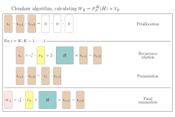

```julia

```
# [Reducing memory access (POLFED for big boys)](@id Reducing_Memory_Access)
In [Constructing optimized mapping](@ref Constructing_Optimized_Mapping) section we have optimized the mapping by exploiting the structure of the Hamiltonian. By separating diagonal and off-diagonal parts and using the fact that all off-diagonal elements have the same value, we reduced memory access during the mapping operation. In this section, we will demonstrate how to further reduce memory access.
```julia

```
## Rescaled_mapping
!!! warning "Rescaled mapping function requirements"
    The  rescaled mapping function must have the same structure as unrescaled one, `f!_rescaled(Y, X)`, where `Y` is the output vector/matrix and `X` is the input vector/matrix. It should perform the operation `Y .= A * X`, where `A` is the implicit `RESCALED` matrix represented by the mapping. The function must handle both single vectors and matrices (for block Lanczos) correctly. 
```julia

```
Even though constructed mapping is allready quite optimized (in terms of memory access), we can do even better by using the allready rescaled mapping. Because spectral transformation of [`polfed`](@ref) uses Chebyshev polynomials, we need to operate with rescaled Hamiltonian. That means, that we first need to find minimal and maximal energy of the hamiltonian (we can use [`Polfed.Lanczos.lanczos`](@ref) for that), and then we can construct rescaled mapping for a matrix as $\frac{H - \text{center}}{\text{spread}}$
```julia

L = 14; Nup = L÷2; Δ = 0.55
howmany = 100
target = 0.0
mat = construct_XXZ_matrix(L, Δ, Nup)
diagonals, offdiag_val, flat, starts = get_diags_and_offdiagonals_single_value(mat)
f! = mapvec_with_xxz!(diagonals, offdiag_val, flat, starts)
v0 = rand(size(mat,1)); v0 ./= norm(v0)

Emin = first(collect(Polfed.Lanczos.lanczos(f!, v0, 1; which=:SR, maxdim=1000)[1]))
Emax = last(collect(Polfed.Lanczos.lanczos(f!, v0, 1; which=:LR,  maxdim=1000)[1]))
spread = (Emax - Emin) / 2
center = (Emax + Emin) / 2

f!_rescaled_bad = (Y,X) -> begin
    f!(Y,X) 
    @. Y *= 1/spread
    @. Y -= (center/spread)*X
end 

```
One can see that `f!_rescaled_bad` mapping produces $$3\cdot\text{hilbertspacedim}$$ more memory accesses then `f!` mapping. Obviously, this rescaling does not produce any aditional matrix elements, what is does is to subtract diagonals with `center/spread` and multiply offdiagonals with `1/spread`. Therefore we can construct rescaled mapping directly from the existing function `mapvec_with_xxz`, one only needs to rescale them. 
```julia
diags_rescaled = @. (diagonals  - center)/spread
offdiag_val_rescaled = @. offdiag_val  * (1/spread)
f!_rescaled = mapvec_with_xxz!(diags_rescaled, offdiag_val_rescaled, flat, starts)
```
Now we can again benchmark both mappings to see the speedup
```julia
X = rand(size(mat,1)); Y = similar(X);
@btime $f!_rescaled_bad($Y,$X);
@btime $f!_rescaled($Y,$X);
```
As one can see from the benchmark results, the rescaled mapping is about $10\%$ faster than the original mapping. This is because it reduces the number of memory accesses during the mapping operation, leading to improved performance (even though memory access is coalesced). Because this rescaled function is called lots of times during spectral information,  there is also some function call overflow, that is avoided by constructing rescaled mapping directly. This also impacts the performance of polfed method, increasing a speedup to roughly $20\%$.
```julia

```
The question is, how to now pass in the rescaled mapping into [`polfed`](@ref) function?
All mapping-related options live in [`MappingConfig`](@ref). Here we only need to set
the `f!_rescaled` and the rescaling bounds.
```julia

v0_ = rand(size(mat,1), 1); v0 = Matrix(qr(v0_).Q)
```
v0 = rand(size(mat,1)); v0 .*= 1/norm(v0)
```julia

mapping = MappingConfig(;
    parallelization = MulColsParallel(),
    f!_rescaled = f!_rescaled,
    Emin = Emin,
    Emax = Emax,
)
vals, vecs, report = polfed(f!, v0, howmany, target; produce_report = true, mapping=mapping)
display_report(report)


```
## Clenshaw recurrence relation
There is even one step further that is worth optimizing that is the recurrence part of clenshaw algorithm

Here unnecessary memory access can be avoided by updating directly the vector ``b_i``, doing all of the operations at once. With that in mind we can write our own clenshaw recurrence and final sumation function that avoids unnecessary memory access. Here is how such function would look like:
```julia

function clenshaw_with_xxz!(
    diags::Vector{Float64},
    offdiags_flatten::Vector{Int},
    start_indices::Vector{Int},
    offdiag_val::Float64,
)

    crr = @inline (b1::AbstractVector, b2::AbstractVector, b3::AbstractVector, c::Real, X::AbstractVector) -> begin

        for i in eachindex(start_indices)
            @inbounds start = start_indices[i]
            @inbounds stop  = (i == length(start_indices)) ? length(offdiags_flatten) : start_indices[i+1]-1

            sum_val = 0.0
            for j in start:stop
                @inbounds sum_val += b2[offdiags_flatten[j]]
            end

            @inbounds yi = muladd(diags[i], b2[i], offdiag_val * sum_val)
            @inbounds b1[i] = c*X[i] + 2*yi - b3[i]
        end
    end


    cfs = @inline (b1::AbstractVector, b2::AbstractVector, c::Real, Y::AbstractVector, X::AbstractVector) -> begin

        for i in eachindex(start_indices)
            @inbounds start = start_indices[i]
            @inbounds stop  = (i == length(start_indices)) ? length(offdiags_flatten) : start_indices[i+1]-1

            sum_val = 0.0
            for j in start:stop
                @inbounds sum_val += b1[offdiags_flatten[j]]
            end

            @inbounds yi = muladd(diags[i], b1[i], offdiag_val * sum_val)
            @inbounds Y[i] = c*X[i] + yi - b2[i]
        end
    end


    return crr, cfs
end

```
We now pass the clenshaw functions into the spectral transformation configuration, from obvious reson we should pass rescaled parameters to `clenshaw_with_xxz!` function.
```julia
crr, cfs = clenshaw_with_xxz!(diags_rescaled, flat, starts, offdiag_val_rescaled)
mapping = MappingConfig(;
    parallelization = MulColsParallel(),
    f!_rescaled = f!_rescaled,
    clenshaw_recurrence = crr,
    clenshaw_finalsum = cfs,
)
v0 = rand(size(mat,1)); v0 .*= 1/norm(v0)
vals, vecs, report = polfed(f!, v0, howmany, target; produce_report = true, mapping=mapping)
display_report(report)

```
So far we have implemented quite few optimizations, starting from constructing optimized mapping, then rescaled mapping and finally custom clenshaw functions. Each of these optimizations reduces memory access during the mapping and polynomial evaluation, leading to significant performance improvements. You might notice by now that all of these mappings were quite general. That is why these techniques can be applied to a wide range of Hamiltonians beyond the XXZ model, as long as they share similar structural properties (e.g., constant off-diagonal elements). By leveraging these optimizations, one can achieve substantial speedups in POLFED calculations for various quantum many-body systems. For models that fall into this category, these optimizations are already implemented in the polfed package, for more see REF.
```julia

```
